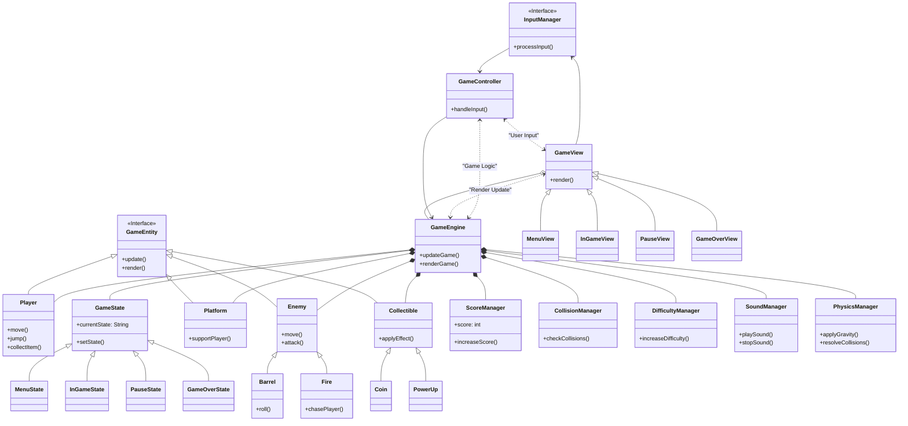

# CoffeBreak

CoffeBreak ha le stesse meccaniche di Donkey Kong. Uno studente cerca di farsi la sua pausa caffè e deve raggiungere la macchinetta che si trova in cima ad una struttura protetta dal tecnico delle macchinette. Quest'ultimo, ben consapevole del letale rischio di bersi 6 caffe al giorno, cerca di impedire la scalata al povero laureando tirandogli bottiglie di fluidi senza caffeina. L'idratazione è importante. Lo studente ha solo due modi per evitarle: saltarle o usando il power up. Durante il tragitto, si potranno trovare delle monetine che verranno raccolte immediatamente. Per raggiungere il suo obiettivo avrà a disposizione 3 appelli (vite) alla fine dei quali sarà costretto a rinunciare agli studi, la stanchezza non perdona!

# Email dei componenti:
 - grazia.bochdanovits@studio.unibo.it
 - lorenzo.boccuzzi@studio.unibo.it
 - alessandro.rebosio@studio.unibo.it
 - filippo.ricciotti@studio.unibo.it

# Diagramma UML

